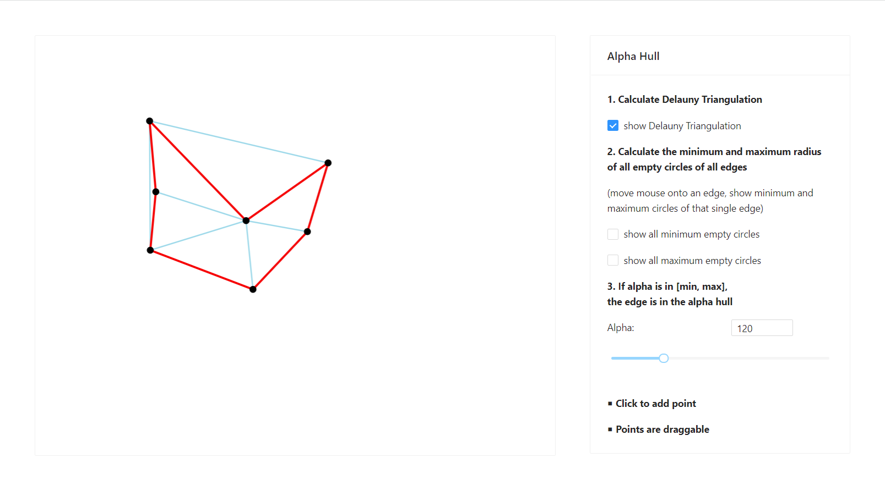

# Alpha Hull Demo
Linyan Jiang (Student id: 502532)

An graphical demo of Alpha Hull using JavaScript

------

Online demo: http://ec2-18-219-94-240.us-east-2.compute.amazonaws.com:3000/

- Using a JavaScript library Delaunator: https://github.com/mapbox/delaunator
- After calculate Delaunay Triangulation,  the demo applet calculate the minimum and maximum radius of all empty circles of all edges.
  - All minimum or maximum empty circles can be shown by selecting the checkbox
  - The minimum and maximum empty circles of a particular edge can be shown by moving the mouse onto it.
- By adjusting the slider, the applet can show the alpha hull of different alpha.
- Please open the demo page by computer browser.
- Please let me know if the page was down
